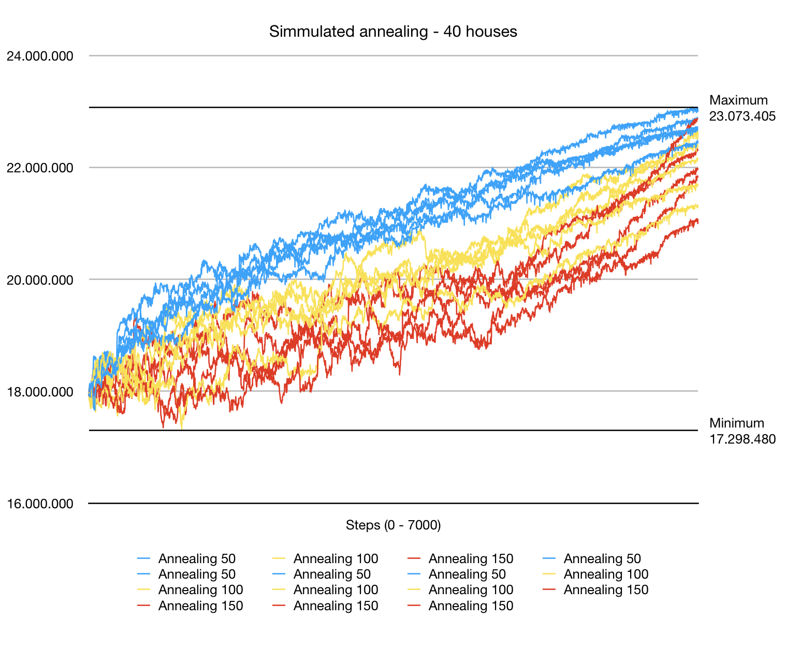

# Results of Experimentation with the Simulated Annealing Algorithm

## 20 houses

## 40 houses
As an experiment simmulated annealing was ran 15 times. The aim was to compare different cooling schemes against eachother. The 15 runs consisted of five runs with a starting temperature of 150, five runs of 100 and five runs of 50. The results of this experiment are plotted in the following graph:

This graph shows that the runs with the lower starting temperature of 50 generally stayed higher. But near the end as the runs of 50 start flattening the runs of 150 can be seen rising more steeply. This could indicate that if the runs were longer those with a starting temperature of 150 could have surpassed those with a starting temperature of 50. More research is needed before a certain conclusion can be reached.

## 60 houses