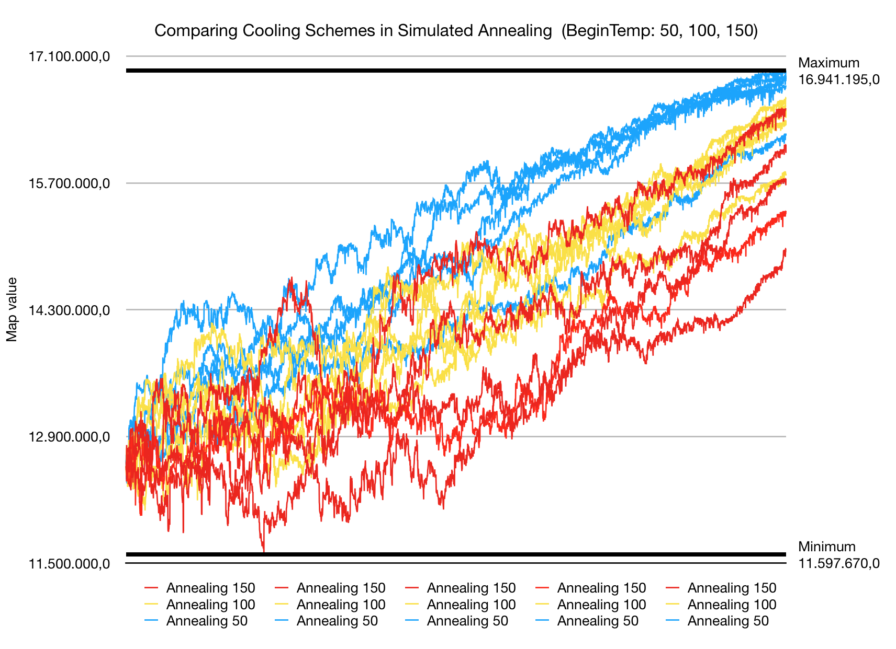

# Results of Experimentation with the Simulated Annealing Algorithm

## 20 houses
We ran simmulated annealing 15 times. The aim was to compare different cooling schemes against eachother. The 15 runs consisted of five runs with a starting temperature of 150, five runs of 100 and five runs of 50. The end temperature was always 0 degrees. The results of this experiment are plotted in the following graph:

This graph shows that the runs with the lower starting temperature of 50 generally ended with higher map values. But near the end as the runs of 50 start flattening the runs of 150 can be seen rising more steeply. In general the runs with 150 as starting temperature can be seen to be more capricious and accept very steep drops in map value. This all could indicate that if the runs were longer (more steps) those with a starting temperature of 150 could have surpassed those with a starting temperature of 50. More research is needed before a certain conclusion can be drawn.

## 40 houses
As an experiment simmulated annealing was ran 15 times. The aim was to compare different cooling schemes against eachother. The 15 runs consisted of five runs with a starting temperature of 150, five runs of 100 and five runs of 50. The results of this experiment are plotted in the following graph:

This graph shows that the runs with the lower starting temperature of 50 generally stayed higher. But near the end as the runs of 50 start flattening the runs of 150 can be seen rising more steeply. This could indicate that if the runs were longer those with a starting temperature of 150 could have surpassed those with a starting temperature of 50. More research is needed before a certain conclusion can be drawn.

## 60 houses