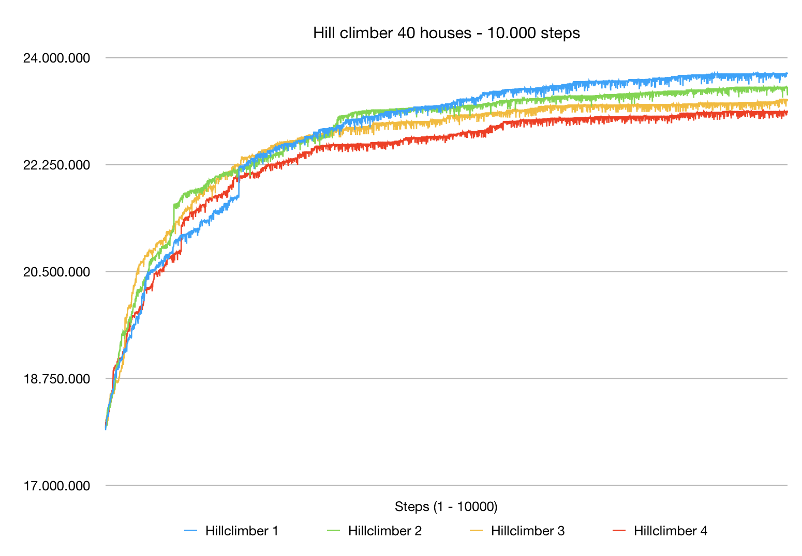

# Results of Experimentation with the Hillclimbing Algorithm

## 20 houses

## 40 houses
As an experiment 4 hillclimbers were ran on the best generated random map with 40 houses. Each hillclimber ran for 10.000 steps. The following graph shows the increase in value as each hillclimber climbed.

As this graph shows the increase really starts to flatten at around 6000 steps and really plateaus at around 9000 steps.

The highest result was 23746020. The lowest result was 23125935. That is a difference of 620.085. This difference is much smaller than the differnce between the highest and lowest random maps. This is as expected since these hillclimbers are much more similar in what they do.

## 60 houses
As an experiment 5 hillclimbers were ran on the best generated random map with 60 houses. Each hillclimber ran for 10.000 steps. The following graph shows the increase in value as each hillclimber climbed.

The highest result was 29666850. The lowest result was 29386815. That is a difference of 280.035. This difference is much smaller than the differnce between the highest and lowest random maps. This is as expected since these hillclimbers are much more similar in what they do.
