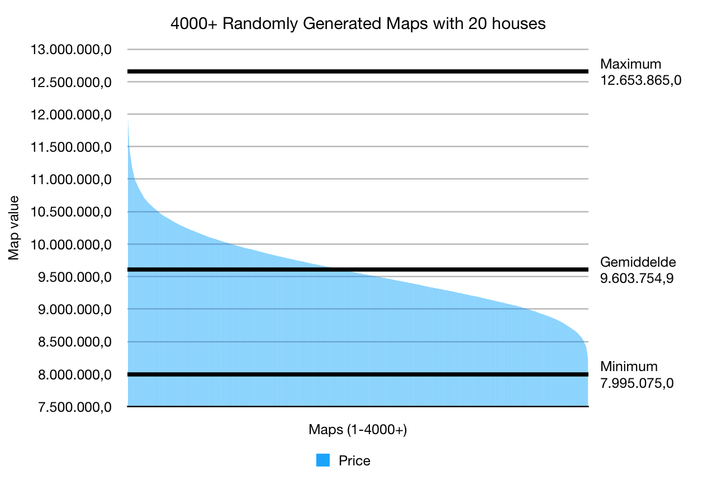
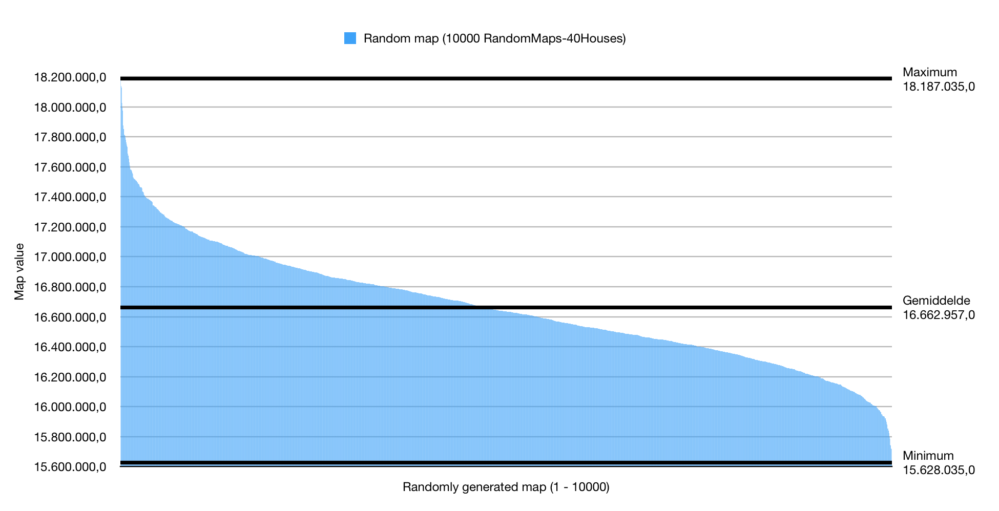
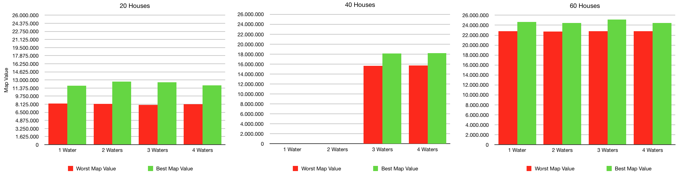

# Results of Experimentation with the Random Algorithm

## 20 houses
As an experiment the random generator was ran and created 4000 maps with 20 houses. Four runs of at least 1000 maps were done. The first run with 1 water body per map, the second run with 2 water bodies and so on. In this document the results will be compared.

### Results
The lowest value generated was 7.995.075. The highest value generated was 12.653.865. This means the range of values was  = 4.658.790.

The results are plotted in this graph:

The graph shows that there are very few outliers in the highest and lowest regions. This means generating random maps will generally not result in the high map values that we are looking for.

## 40 houses
As an experiment the random generator was ran and created 4000 maps with 40 houses. Four runs of 1000 maps were done. The first run with 1 water body per map, the second run with 2 water bodies and so on. In this document the results will be compared.

### Results
The lowest value generated was 15628035. The highest value generated was 18187035. This means the range of values was 18187035 - 15628035 = 2.559.000

The results are plotted in this graph:

The graph shows that there are very few outliers in the highest and lowest regions. This means generating random maps will generally not result in the high values that we are looking for.

## 60 houses

## Few or many waterbodies?
We wondered wether the amount of water would have a big impact on the value of the map. Therefore we compared the highest and lowest map values of all diferent map configurations. 

### Results
The results of this comparison can be seen in this figure:  and the table below:

| Water Areas | Houses    | Worst Map Value | Best Map Value |
|-------------|-----------|-----------------|----------------|
| 1 Water     | 20 Houses | *8.258.955*     | 11.827.950     |
| 2 Waters    | 20 Houses | 8.185.245       | *12.653.865*   |
| 3 Waters    | 20 Houses | 7.995.075       | 12.551.340     |
| 4 Waters    | 20 Houses | 8.148.225       | 11.915.220     |
| 1 Water     | 40 Houses |                 |                |
| 2 Waters    | 40 Houses |                 |                |
| 3 Waters    | 40 Houses | 15.628.035      | 18.139.845     |
| 4 Waters    | 40 Houses | *15.719.000*    | *18.187.035*   |
| 1 Water     | 60 Houses | 22.769.565      | 24.631.680     |
| 2 Waters    | 60 Houses | 22.690.080      | *24.432.030*   |
| 3 Waters    | 60 Houses | *22.804.272*    | 25.100.010     |
| 4 Waters    | 60 Houses | 22.799.205      | 24.469.575     |

We cannot draw a clear cut conclusion from the obtained results. For 20 houses 1 water area delivers the best value, 2 water areas the best. For 40 houses 4 water areas deliver the worst value and the best value. And for 60 houses 3 water areas gives the worst value and 2 water areas the best. To compare the impact of water areas on a map more random maps should be generated.
